# BOBPLE 🍽️

## ✅ 프로젝트 소개

- 프로젝트명: BOBPLE
- 프로젝트 기간: 2024.7.15 ~ 2024.8.25 (6주)
- 팀원: 전상민, 신지현, 손유정, 송예준, 오민택, 조서영, 최재원

 

## ✅ 기획 배경 및 소개

오늘날 대학생 및 직장인들은 바쁜 일상 속에서 매번 식사 메뉴를 결정하는 데 어려움을 겪고 있음

단순한 메뉴 추천 서비스에서 벗어나, 다양한 보상과 활발한 커뮤니티를 통해 사용자 참여를 유도하고, 즐거운 식사 경험을 제공함

 

**📍 위치 기반 맛집 추천**

- 내 위치 근처 맛집 지도 제공
- 실시간 검색 데이터를 기반으로 한 메뉴 추천

🍱 **레시피 공유**

- 점심 도시락 레시피 공유
- AI 기반 재료 맞춤형 레시피 추천

🕹️ **게임과 포인트**

- 음식 맞추기, 룰렛 등 다양한 게임 제공
- 포인트로 기프티콘 구매 및 사용

**👥 유저 커뮤니티**

- 함께 식사할 사람 모집 및 채팅
- 식사 후 영수증 금액 정산

 

# ✅ 기술 스택

  
  
  
  
  
  
  
  
   
  
  
   
   
   
  
     
  
  
  
  
   

### UML
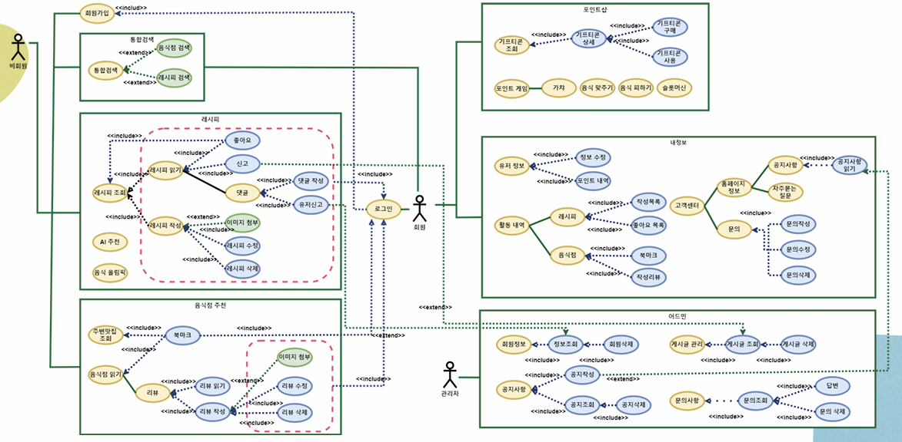

### ERD
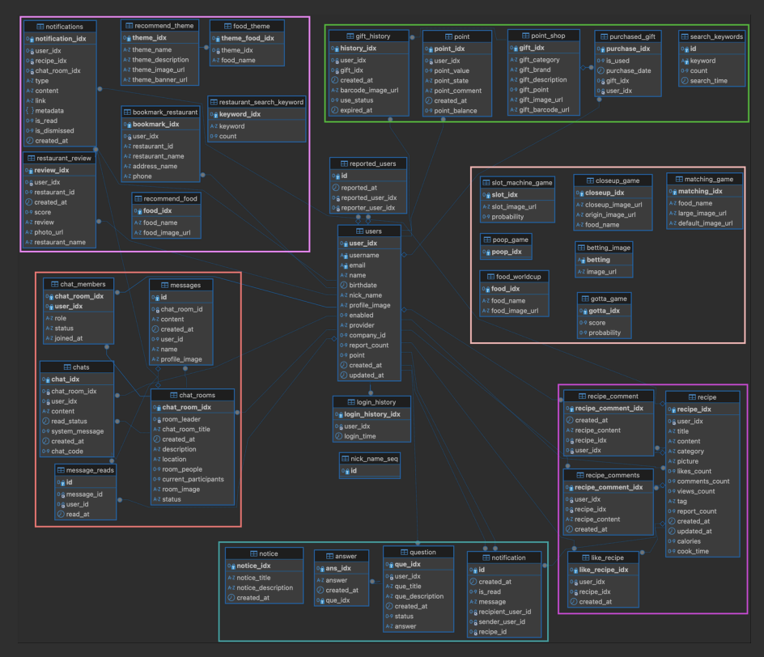

 

# **✅ 주요 구현 내용**

🍴 **맛집 페이지 구현**

- 통합 검색 및 실시간 인기 검색어
- 주변 맛집
    - Geolocation, 카카오맵, 네이버 서치 API 활용
    - 위치 기반 지도 생성, 음식점 마커 표시
    - 클릭 시 상세 정보 → 음식점 이름 클릭 시 음식점 상세 페이지로 리디렉션
- 맛집 추천
    - 랜덤 메뉴 추천, 음식 월드컵, 테마/카테고리별 음식 추천, 회식 장소 PICK 기능
        - 테마/카테고리별 음식 추천
            - 상단: 북마크 수 많은 인기 음식점
            - 하단: 검색된 음식점 거리 순 정렬
- 맛집 상세
    - 음식점 상세 정보, 리뷰 CRUD

 

💰 **포인트 정책**

- 매일 출석 포인트 지급
- 포인트 적립 및 사용 내역 기록
- 포인트 게임
    - 하루 1번 가능
    - 게임 결과에 따른 포인트 지급

 

🕹️ **게임 백엔드 구현**

- 음식 월드컵, 랜덤 가챠, 음식 확대사진 맞추기, 과일 피하기, 슬롯 머신 게임 백엔드 구현

 

### 통합 검색 기능 화면
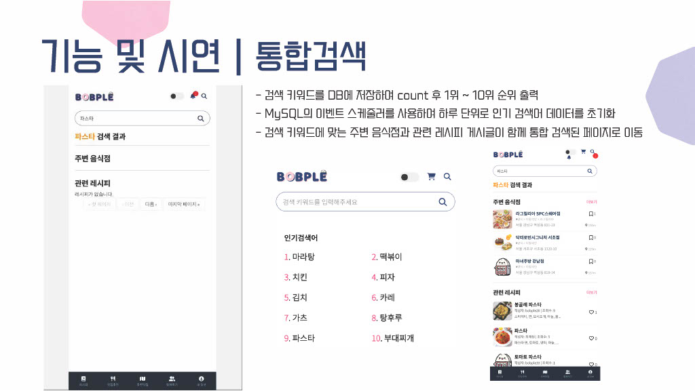

 

### 주변 맛집 기능 화면
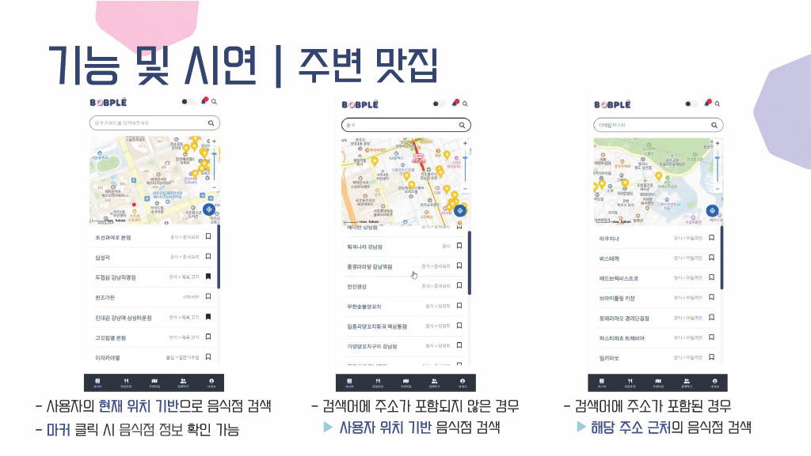
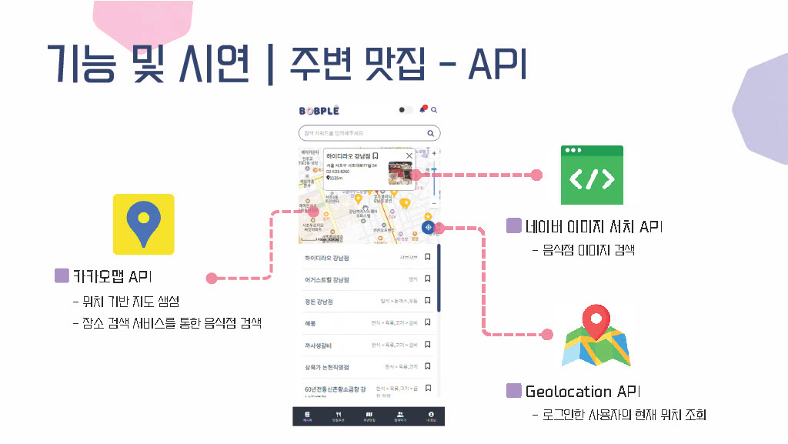

### 맛집 추천 기능 화면
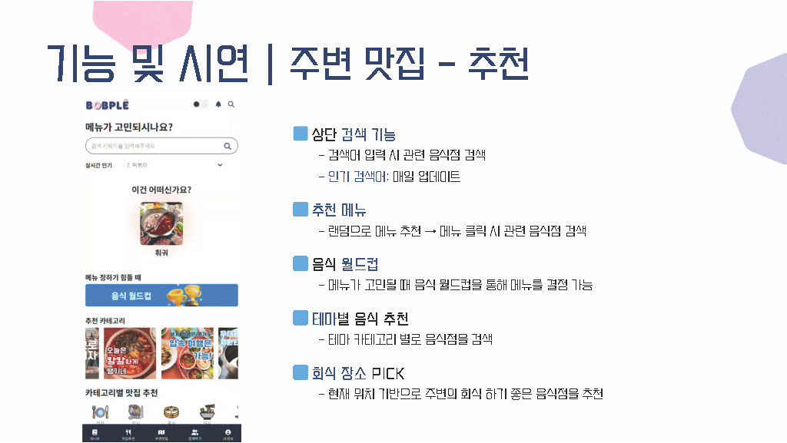
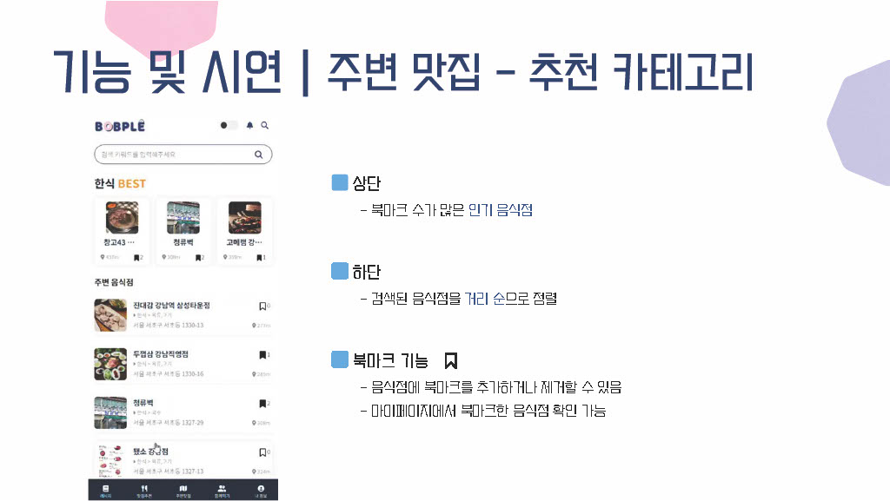

### 맛집 상세 기능 화면
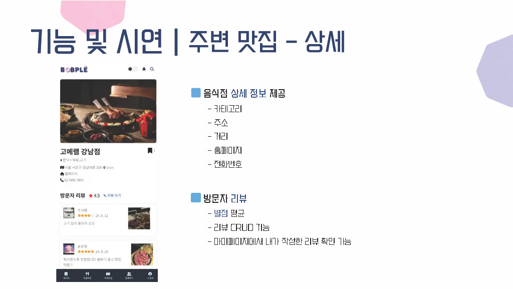

 

### 포인트 정책 기능 화면
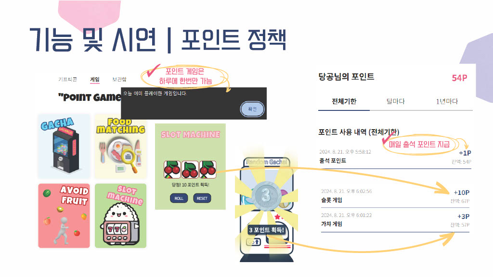

### 게임 기능 화면
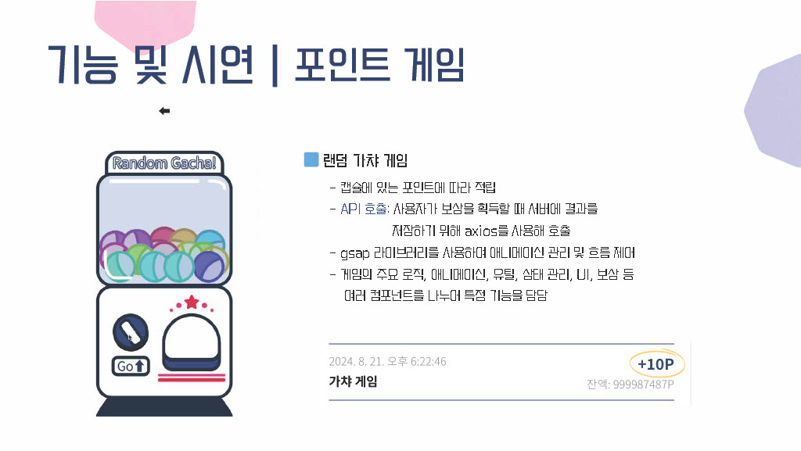
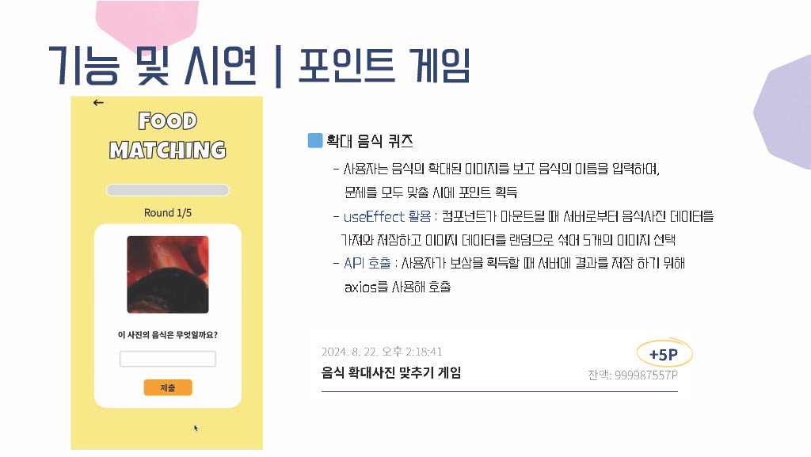
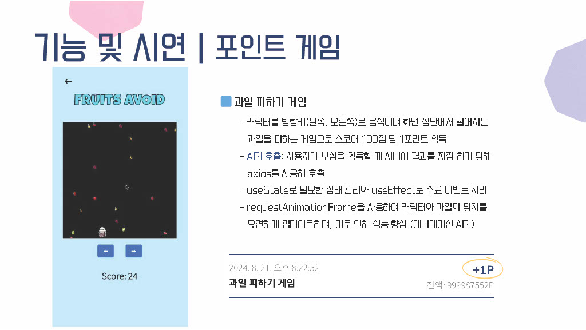
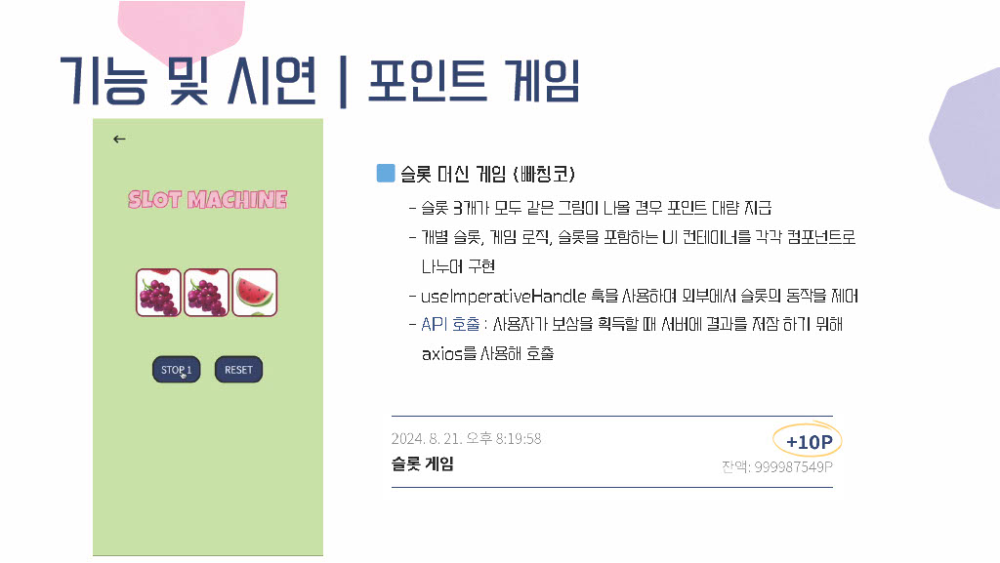
